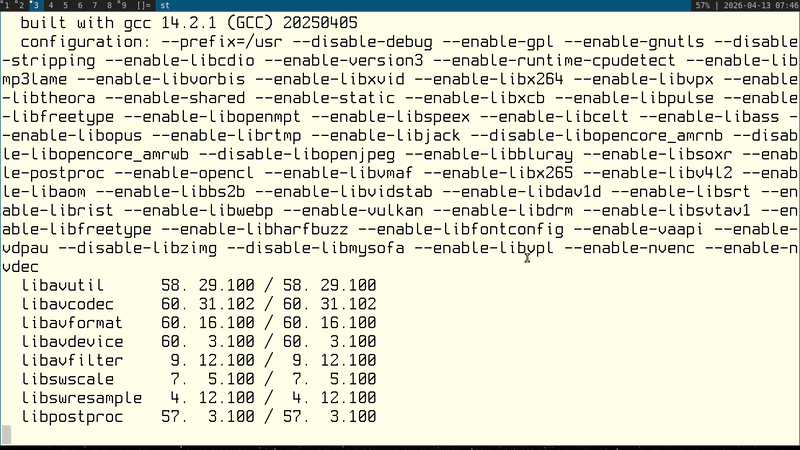

* Пока только 2 функции - бесконечное редактирование резюме каждые 10 секунд (даже если вкладка неактивна) и бесконечная отправка предлагаемых сообщений в чате, когда открыл чат каждые 10 секунд. Обе функции открываются как кнопки на странице резюме и в доступном чате.
* Для автономного запуска и контроля добавлен сервер в папке hh-stats-server. Использует sqlite для записи статистики в формате

`[{"type":"editor","value":5,"updated_at":"2026-04-13 01:40:35"},{"type":"chat","value":7,"updated_at":"2026-04-13 01:40:39"}]` - общие межсессионные значения + время последнего изменения

Рабочий порт: `3020`

Для запуска: `npm install && npm start`

Для просмотра статистики: `curl localhost:3020/stats`

* Все ошибки отображаются в консоли - можете слать в Issues.

Icon by: zerosonesfun

Link to icon: https://github.com/zerosonesfun/BittyKitty?tab=License-1-ov-file

